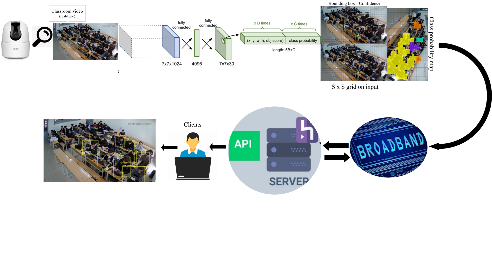

# Hệ Thống Phát Hiện Sinh Viên Trong Lớp Học


<p align="center">
  
    
</p>

[](https://www.facebook.com/DNUAIoTLab)
[](https://fitdnu.net/)
[](https://dainam.edu.vn)
</div>

Dự án này phát triển hệ thống phát hiện đối tượng sinh viên trong lớp học, góp phần nâng cao hiệu quả quản lý lớp học.

## 📋 Tổng Quan
### Kiến trúc hệ thống:
<p align="center">
  
</p>

Hệ thống sử dụng mô hình YOLOv12 phiên bản small để nhận diện sinh viên trong lớp học qua camera, kết hợp với giao diện web để hiển thị kết quả và quản lý.

## 🔍 Thành Phần Chính

### 📷 Camera Module
- Thu thập hình ảnh từ lớp học
- Truyền dữ liệu qua đường stream

### 🖥️ Flask API
- Xử lý các yêu cầu từ Web UI
- Xử lý hình ảnh/video từ camera
- Áp dụng mô hình YOLOv12 để phát hiện sinh viên
- Lưu trữ kết quả và phân tích dữ liệu

### 🌐 Web UI
- Hiển thị video trực tiếp từ camera
- Hiển thị kết quả phát hiện đối tượng
- Cung cấp giao diện quản lý và thống kê

## ⚙️ Hướng Dẫn Cài Đặt

1. Clone repository này về máy:
   ```bash
   git clone https://github.com/your-username/student-detection-system.git
   cd student-detection-system
   ```

2. Cài đặt các thư viện Python cần thiết:
   ```bash
   pip install -r requirements.txt
   ```

- Lưu ý nếu bị thông báo lỗi attn ( Đây là một lớp attention ). Thì hãy chọn mô hình phiên bản (v) thấp hơn.
3. Cấu hình camera:
   - Lấy địa chỉ IP của camera
   - Thêm đường stream từ IP camera (xem thêm trong file `route.py` để hiểu cách cấu hình)

4. Khởi động máy chủ:
   ```bash
   python run.py
   ```

5. Truy cập giao diện web tại địa chỉ server đã cấu hình

## 📁 Cấu Trúc Dự Án

```
student-detection-system/
├── app/                     # Thư mục chính của ứng dụng
│   ├── __init__.py          # Khởi tạo ứng dụng Flask
│   ├── routes.py            # Định tuyến API và xử lý yêu cầu
│   ├── models/              # Mô hình YOLOv12
│   ├── static/              # CSS, JavaScript, hình ảnh
│   └── templates/           # HTML templates
│       └── index.html       # Giao diện người dùng chính
├── training/                # Mã nguồn huấn luyện mô hình
├── evaluation/              # Mã nguồn đánh giá mô hình
├── statistics/              # Mã nguồn phân tích thống kê
├── run.py                   # Script khởi động ứng dụng
└── requirements.txt         # Danh sách thư viện cần thiết
```

## 📊 Dữ Liệu

## 🔗 Tải Mô Hình Huấn Luyện

Do giới hạn dung lượng của GitHub, file mô hình đã được lưu trữ ngoài hệ thống.

👉 [Tải mô hình huấn luyện tại đây (Google Drive – ~1.5GB)](https://drive.google.com/file/d/1ET_vo9y6kYB59Y0s2VB5AMgvkKYq8a2l/view?usp=drive_link)

Nếu không tải được, vui lòng kiểm tra quyền truy cập hoặc liên hệ với tác giả.

## 🛠️ Công Nghệ Sử Dụng

- **Deep Learning**: YOLOv12, PyTorch
- **Backend**: Flask, OpenCV
- **Frontend**: HTML, CSS, JavaScript
- **Phân tích dữ liệu**: NumPy, Pandas, Matplotlib

## 📝 Liên Hệ

[TrangNe-0355864xxx]

## 📜 Giấy Phép

[@Nguyễn_Thị_Trang]
[@DaiHocDaiNam]

---

*Lưu ý: Đọc thêm file `route.py` để hiểu chi tiết về cách cấu hình đường stream camera.*
